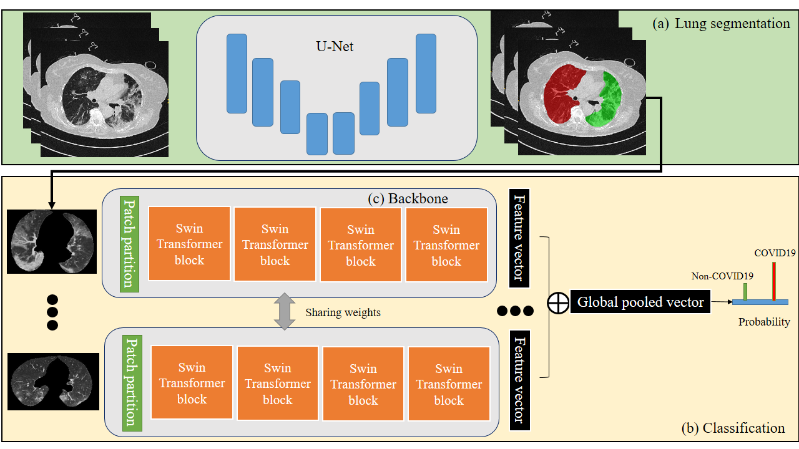
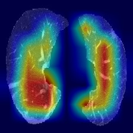
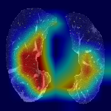
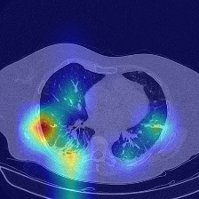

#COVID19T
This repo contains the implmentation of the paper- 'MIA-COV19D: A transformer-based framework for COVID19 classification in chest CTs'




### Notices
This is a part of work in the COV19D Competition
https://mlearn.lincoln.ac.uk/mia-cov19d/
### Citation
If you find this code is useful for your research, please consider citing:
```
@article{,
  title={MIA-COV19D: A transformer-based framework for COVID19 classification in chest CTs},
  author={Lei Zhang, Yan Wen},
  year={2021}
}
```

## Setup
### Prerequisites
- Annocoda
- python 3.8.10
- pytorch 1.8.1
- torchvision 0.9.1
- SimpleITK 2.0.2
- batchgenerators
- tensorboardX
- timm=0.4.9
```
refer the requirement.txt for more specification 
```


## COVNet
  

### Acknowledgement 
This implemntation is highly relied on the repoes 
https://github.com/microsoft/Swin-Transformer/blob/main/get_started.md
https://github.com/bkong999/COVNet
Thanks for these great work
